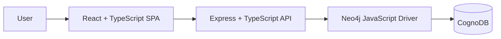
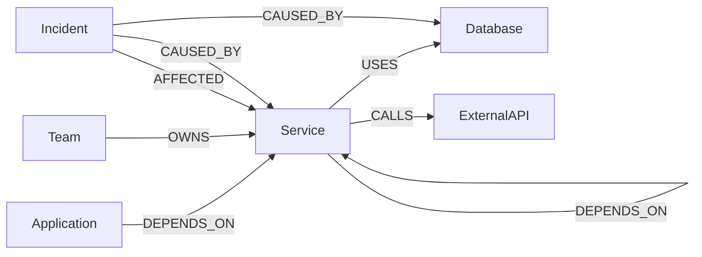

# TraceGraph — Production Dependency & Incident Intelligence

TraceGraph is a graph-backed production intelligence application for exploring software dependencies, identifying service ownership, understanding incident impact, and calculating failure blast radius across connected infrastructure.

> If this service fails, what else is affected, who owns it, and what is the likely root cause?

## Live Demo

- **Frontend:** https://tracegraph-sandy.vercel.app
- **API:** https://tracegraph-api-u6ul.onrender.com
- **Health:** https://tracegraph-api-u6ul.onrender.com/health
- **Readiness:** https://tracegraph-api-u6ul.onrender.com/ready

## Problem

Modern production systems are connected networks of applications, services, databases, external APIs, engineering teams, and incidents.

TraceGraph helps answer:

- What does this service depend on?
- Which services and applications depend on it?
- If this service fails, what is the blast radius?
- Which team owns the affected service?
- What infrastructure component caused an incident?
- How many dependency hops away are affected components?

## Why a Graph Database?

This problem is relationship-heavy by nature.

A relational implementation would typically require several join tables together with recursive CTEs or repeated self-joins to answer multi-hop dependency questions.

A graph database models those relationships directly. With openCypher, dependency and impact analysis can be expressed as path traversal instead of reconstructing the graph through joins.

For example, TraceGraph calculates reverse dependency impact with:

```cypher
MATCH path =
  (dependent)
  -[:DEPENDS_ON*1..4]->
  (target:Service {id: $serviceId})

WHERE dependent:Service
   OR dependent:Application

WITH
  dependent,
  min(length(path)) AS depth

RETURN
  dependent,
  labels(dependent) AS labels,
  depth

ORDER BY depth, dependent.name
```

This directly answers:

**“If this service fails, which upstream services and applications are affected, and how many hops away are they?”**

## Architecture



Backend data flow:

```text
Route
  ↓
Controller
  ↓
Service
  ↓
Repository
  ↓
Parameterized Cypher
  ↓
CognoDB
```

The frontend never connects directly to CognoDB. Database credentials remain backend-only.

## Tech Stack

### Frontend

- React
- TypeScript
- Vite
- React Router
- TanStack Query
- React Flow / XYFlow
- Tailwind CSS
- Lucide React

### Backend

- Node.js
- TypeScript
- Express
- Zod
- Neo4j JavaScript Driver
- Vitest
- Supertest

### Infrastructure

- CognoDB Cloud
- Render
- Vercel

## Graph Model



### Node Labels

| Label | Purpose |
| --- | --- |
| `Application` | User-facing application |
| `Service` | Backend or platform service |
| `Database` | Persistent or caching datastore |
| `ExternalAPI` | Third-party dependency |
| `Team` | Operational ownership |
| `Incident` | Production incident |

### Relationship Types

| Relationship | Meaning |
| --- | --- |
| `Application-[:DEPENDS_ON]->Service` | Application runtime dependency |
| `Service-[:DEPENDS_ON]->Service` | Service-to-service dependency |
| `Service-[:USES]->Database` | Datastore usage |
| `Service-[:CALLS]->ExternalAPI` | Third-party dependency |
| `Team-[:OWNS]->Service` | Operational ownership |
| `Incident-[:AFFECTED]->Service` | Incident impact |
| `Incident-[:CAUSED_BY]->Service/Database` | Identified root cause |

See [`docs/graph-model.md`](docs/graph-model.md) for the detailed model.

## Seed Dataset

The demo dataset contains **26 nodes** and **37 relationships**:

- 3 applications
- 8 services
- 5 databases
- 3 external APIs
- 4 engineering teams
- 3 incidents

Example components include API Gateway, Authentication Service, Order Service, Payment Service, Inventory Service, PostgreSQL, Redis, OpenSearch, Stripe, SendGrid, and Twilio.

The seed intentionally includes degraded components and active incidents so the dashboard, incident views, and blast-radius analysis demonstrate meaningful operational states.

## Core Features

### Dashboard

Provides a production overview including service count, application count, active incidents, degraded components, and API/database readiness.

### Service Intelligence

Each service can expose:

- service metadata
- multi-hop downstream dependencies
- multi-hop upstream dependents
- team ownership
- calculated blast radius
- affected services/applications
- maximum impact depth

### Blast Radius Analysis

TraceGraph traverses reverse `DEPENDS_ON` relationships to determine which services and applications would be impacted if a service failed.

### Incident Intelligence

Incident pages connect operational events to severity, status, affected services, timestamps, and identified root-cause infrastructure.

### Graph Explorer

The full production topology is rendered with React Flow and supports search, type filtering, node inspection, direct-neighbor exploration, blast-radius mode, and multi-hop impact highlighting.

## Important Cypher Queries

All dynamic identifiers are passed as query parameters.

### 1. Multi-hop dependency traversal

```cypher
MATCH path =
  (source:Service {id: $serviceId})
  -[:DEPENDS_ON|USES|CALLS*1..4]->
  (dependency)

WITH
  dependency,
  min(length(path)) AS depth

RETURN
  dependency,
  labels(dependency) AS labels,
  depth

ORDER BY depth, dependency.name
```

### 2. Reverse traversal / blast radius

```cypher
MATCH path =
  (dependent)
  -[:DEPENDS_ON*1..4]->
  (target:Service {id: $serviceId})

WHERE dependent:Service
   OR dependent:Application

WITH
  dependent,
  min(length(path)) AS depth

RETURN
  dependent,
  labels(dependent) AS labels,
  depth

ORDER BY depth, dependent.name
```

### 3. Ownership lookup

```cypher
MATCH
  (team:Team)-[:OWNS]->
  (service:Service {id: $serviceId})

RETURN team
LIMIT 1
```

### 4. Incident root cause

```cypher
MATCH
  (incident:Incident {id: $incidentId})
  -[:CAUSED_BY]->
  (cause)

RETURN
  cause,
  labels(cause) AS labels

LIMIT 1
```

## API Endpoints

| Method | Endpoint | Purpose |
| --- | --- | --- |
| GET | `/health` | API liveness |
| GET | `/ready` | API + database readiness |
| GET | `/api/dashboard` | Dashboard summary |
| GET | `/api/services` | List services |
| GET | `/api/services/:id` | Service detail |
| GET | `/api/services/:id/dependencies` | Multi-hop dependencies |
| GET | `/api/services/:id/dependents` | Multi-hop dependents |
| GET | `/api/services/:id/owner` | Service owner |
| GET | `/api/services/:id/blast-radius` | Failure impact analysis |
| GET | `/api/incidents` | List incidents |
| GET | `/api/incidents/:id` | Incident detail |
| GET | `/api/graph` | Full topology |

## Local Setup

### Prerequisites

- Node.js
- npm
- CognoDB instance

### Backend

```bash
cd apps/api
npm install
```

Copy `.env.example` to `.env`, then set your real CognoDB credentials only in `.env`.

```env
PORT=4000
CORS_ORIGIN=http://localhost:5173

COGNODB_URI=your-cognodb-bolt-uri
COGNODB_USERNAME=your-cognodb-username
COGNODB_PASSWORD=your-cognodb-password
```

Seed and run:

```bash
npm run seed
npm run dev
```

### Frontend

```bash
cd apps/web
npm install
```

Create `.env` with:

```env
VITE_API_URL=http://localhost:4000
```

Then:

```bash
npm run dev
```

## Build and Test

Backend:

```bash
cd apps/api
npm test
npm run build
```

Frontend:

```bash
cd apps/web
npm run lint
npm run build
```

## Production Deployment

### Frontend — Vercel

- Root directory: `apps/web`
- Build command: `npm run build`
- Output directory: `dist`
- `VITE_API_URL=https://tracegraph-api-u6ul.onrender.com`

### Backend — Render

- Root directory: `apps/api`
- Build command: `npm ci && npm run build`
- Start command: `npm start`
- Health check: `/health`

Required environment variables:

```text
COGNODB_URI
COGNODB_USERNAME
COGNODB_PASSWORD
CORS_ORIGIN
```

## Project Structure

```text
tracegraph/
├── apps/
│   ├── api/
│   └── web/
├── docs/
│   └── graph-model.md
└── README.md
```

## Screenshots

Add these before final submission:

1. Dashboard
2. Graph Explorer with Payment Service blast radius
3. Payment Service detail page
4. `INC-1001` incident detail / root-cause view

## Demo Recording

Add the short demo recording link here before final submission.

Suggested walkthrough:

1. Dashboard and system overview
2. Graph Explorer
3. Select Payment Service
4. Show blast-radius mode
5. Open Payment Service detail and show ownership/dependencies
6. Open `INC-1001` and show root cause
7. Briefly explain why graph traversal is a better fit than recursive relational joins

## Engineering Decisions

- Graph relationships are explicit domain concepts rather than UI-only links.
- Cypher queries use parameters for dynamic identifiers.
- CognoDB access is isolated to the backend.
- Backend follows route → controller → service → repository separation.
- Health/readiness endpoints provide controlled production status.
- Traversal depth is capped at four hops for predictable query cost and demo behavior.

## Future Improvements

- authentication and role-based access
- historical dependency versions
- observability and SLO metrics
- automatic dependency discovery
- shared-dependency analysis
- event-driven incident ingestion
- configurable traversal depth
- caching for frequently requested graph summaries

## Security

- Real CognoDB credentials belong only in local `.env` files and deployment environment variables.
- `.env.example` contains placeholders only.
- Database credentials never reach the browser.
- Cypher identifiers are parameterized.

---

Built as a small but complete graph-database application demonstrating graph modelling, multi-hop traversal, incident intelligence, blast-radius analysis, and production-oriented architecture.
