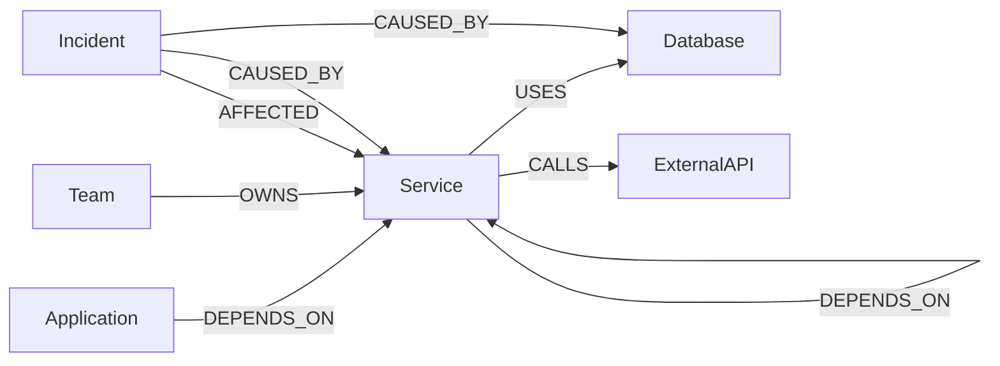

# TraceGraph Data Model

## Overview

TraceGraph models software infrastructure as a connected graph.

Applications depend on services, services depend on other services,
services use databases and external APIs, teams own services, and
incidents affect infrastructure components.

The model is designed to support dependency exploration, impact analysis,
blast-radius detection, ownership discovery, and incident root-cause
analysis.

## Graph Model

## Node Labels

### Application

Represents a user-facing software application.

Properties:

- id
- name
- description
- environment
- status
- criticality

### Service

Represents a backend or platform service.

Properties:

- id
- name
- description
- environment
- status
- criticality
- version

### Database

Represents a persistent or caching data store.

Properties:

- id
- name
- engine
- environment
- status
- criticality

### ExternalAPI

Represents an external third-party dependency.

Properties:

- id
- name
- provider
- status
- criticality

### Team

Represents the team responsible for services.

Properties:

- id
- name
- email

### Incident

Represents an operational incident.

Properties:

- id
- title
- description
- severity
- status
- startedAt
- resolvedAt

## Relationship Types

### DEPENDS_ON

Application -> Service

Service -> Service

Represents runtime or functional dependency between system components.

### USES

Service -> Database

Represents a service using a data store.

### CALLS

Service -> ExternalAPI

Represents communication with a third-party API.

### OWNS

Team -> Service

Represents operational ownership.

### AFFECTED

Incident -> Service

Represents infrastructure affected by an incident.

### CAUSED_BY

Incident -> Service

Incident -> Database

Represents the identified root cause of an incident.

## Primary Query Use Cases

TraceGraph should support:

1. Direct dependency lookup.
2. Multi-hop dependency traversal.
3. Reverse dependency traversal.
4. Blast-radius analysis.
5. Service ownership discovery.
6. Incident impact analysis.
7. Incident root-cause traversal.
8. Shared-dependency detection.